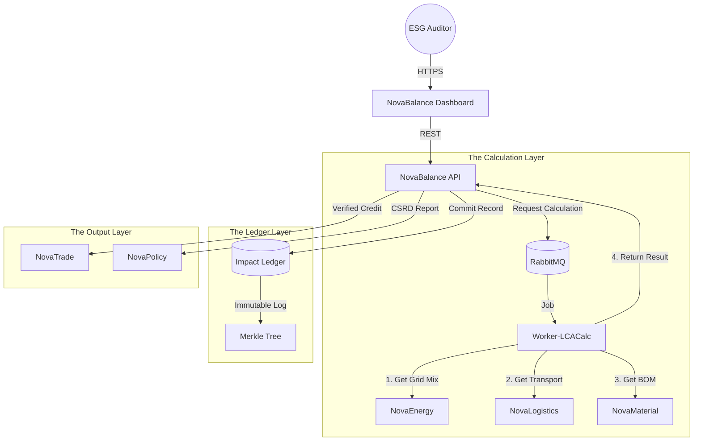

# ⚖️ NovaBalance

> **The Operating System for Environmental Truth.**
> A scientific audit engine for Carbon, Water, Mass Balance, and Planetary Boundaries.

[](https://www.google.com/search?q=https://github.com/novaeco-tech/novabalance/actions)
[](https://opensource.org/licenses/MIT)
[](https://www.google.com/search?q=https://balance.novaeco.tech)

**NovaBalance** is the Horizontal Enabler responsible for **Environmental Auditing**. While `NovaFin` tracks financial debt, **NovaBalance** tracks ecological debt.

It acts as the **"Physics Engine"** of the circular economy. It ingests operational data from all sectors (Energy used, Kilometers driven, Material mass moved) and converts it into standardized impact metrics (CO₂e, Liters H₂O, Toxicity). It provides the "Proof of Impact" required for **NovaTrade** credits and **NovaPolicy** compliance.

-----

## 🎯 Value Proposition

Greenwashing thrives in the absence of data. **NovaBalance** enforces scientific rigor:

1.  **Dynamic LCA:** Replacing static, yearly PDF reports with real-time Life Cycle Assessments. If the grid becomes greener today (`NovaEnergy`), the product made today gets a lower carbon score instantly.
2.  **Mass Balance Verification:** Preventing fraud in recycling. It ensures that a factory cannot sell 100 tons of "Recycled Plastic" if it only bought 50 tons of waste.
3.  **Scope 3 Automation:** Automatically aggregating the footprint of upstream suppliers (`NovaMaterial`) and downstream logistics (`NovaLogistics`) to calculate the full value chain impact.

-----

## 🏗️ Architecture (The Impact Ledger)

NovaBalance decouples the *collection* of data (API) from the heavy *calculation* of impact (Workers).



### Integrated Services

  * **[Worker-LCACalc](https://www.google.com/search?q=https://lca.balance.novaeco.tech):** The math engine. [cite_start]It holds the databases of "Emission Factors" (e.g., Ecoinvent proxies) and performs the physics calculations[cite: 12].
  * **[NovaEnergy](https://www.google.com/search?q=https://energy.novaeco.tech):** Provides the "Scope 2" data. NovaBalance asks: "What was the carbon intensity of the grid at the exact minute this machine was running?"
  * **[NovaLogistics](https://www.google.com/search?q=https://logistics.novaeco.tech):** Provides the "Scope 3 Transport" data. NovaBalance calculates impact based on vehicle type (EV vs Diesel) and distance.
  * **[NovaRecycle](https://www.google.com/search?q=https://recycling.novaeco.tech):** Provides the Mass Balance data. NovaBalance validates that Input Mass == Output Mass + Loss.

-----

## ✨ Key Features

### 1\. The Planetary Boundary Ledger

We track more than just Carbon. The ledger supports multi-dimensional metrics based on the **Planetary Boundaries Framework**:

  * **Climate Change:** kg CO₂ equivalent (GWP100).
  * **Biosphere:** Biodiversity Intactness Index (from `NovaNature`).
  * **Freshwater:** Blue Water Consumption (m³).
  * **Chemicals:** Toxicity Potentials (HTP/ETP).

### 2\. Mass Balance Reconciliation

The anti-fraud engine for the Circular Economy.

  * **Logic:** Periodically queries `NovaRecycle` facilities.
  * **Check:** `Sum(Inbound_Waste) - Process_Loss == Sum(Outbound_Recyclate)`.
  * **Alert:** If the numbers don't match (e.g., phantom inventory), it flags the facility as "Unverified" in `NovaTrade`.

### 3\. Dynamic Product Footprinting

Updates the Digital Product Passport (DPP).

  * When a product is manufactured in `NovaMake`, NovaBalance assigns it a "Birth Footprint."
  * As the product moves (Logistics) or is repaired (Tronix), NovaBalance appends the additional impact to its history.

### 4\. Automated CSRD Reporting

Compliance with the **Corporate Sustainability Reporting Directive**.

  * Aggregates data across all sectors for a specific Organization ID.
  * Generates the XML/XBRL report required by EU regulators, removing the need for expensive manual consulting audits.

-----

## 🚀 Getting Started

We use **DevContainers** to provide a consistent development environment.

### Prerequisites

  * Docker Desktop
  * VS Code (with Remote Containers extension)
  * Python 3.11+ (Scientific Stack: Pandas, NumPy)

### Installation

1.  **Clone the repo:**
    ```bash
    git clone https://github.com/novaeco-tech/novabalance.git
    cd novabalance
    ```
2.  **Open in VS Code:**
      * Run `code .`
      * Click **"Reopen in Container"** when prompted.
3.  **Start the Enabler:**
    ```bash
    make dev
    ```
      * **Audit Dashboard:** http://localhost:3000
      * **API:** http://localhost:8000/docs

### Configuration (`.env`)

```ini
# Ledger Settings
METHODOLOGY=ISO_14040 # or PEF (Product Environmental Footprint)
DEFAULT_UNIT=KG_CO2E

# Integrations
WORKER_LCA_URL=http://novabalance-worker-lca-calculator:8080
NOVAMATERIAL_URL=http://novamaterial-api:8000
```

-----

## 📂 Repository Structure

This is a Monorepo containing the enabler's specific logic.

```text
novabalance/
├── api/                # Python/FastAPI (Domain Logic)
│   ├── src/
│   │   ├── ledger/     # Immutable append-only log for impacts
│   │   ├── mass/       # Mass balance reconciliation logic
│   │   └── reports/    # CSRD/GRI report generators
├── app/                # React/Next.js Frontend (Auditor UI)
│   ├── src/
│   │   ├── dashboard/  # Real-time impact charts
│   │   └── trace/      # Sankey diagrams of material/carbon flow
├── website/            # Documentation (Docusaurus)
└── tests/              # Integration tests
```

-----

## 🧪 Testing

We use **Scientific Validation** testing.

  * **Formula Test:** `make test-math`
      * Verifies that the aggregation logic correctly sums Scope 1, 2, and 3 emissions without double-counting.
  * **Mass Balance Test:** `make test-fraud`
      * Simulates a scenario where Output \> Input. Asserts that the system raises a `FraudAlert` and locks the facility's `NovaTrade` account.

-----

## 🤝 Contributing

We need contributors with backgrounds in **Environmental Science**, **LCA Methodology**, and **Data Engineering**.
See [CONTRIBUTING.md](https://www.google.com/search?q=../.github/CONTRIBUTING.md) for details.

**Maintainers:** `@novaeco-tech/maintainers-enabler-novabalance`